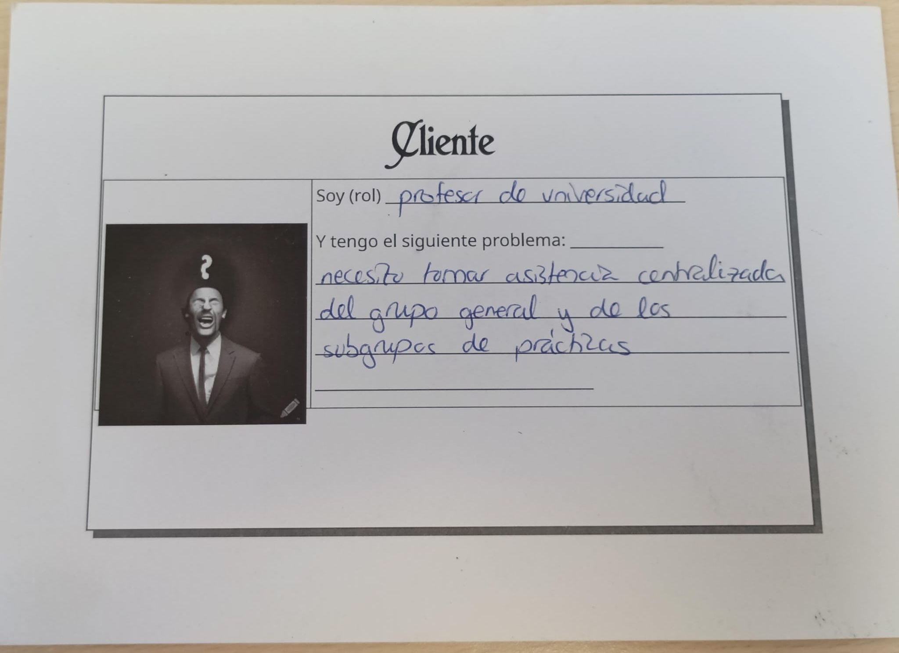
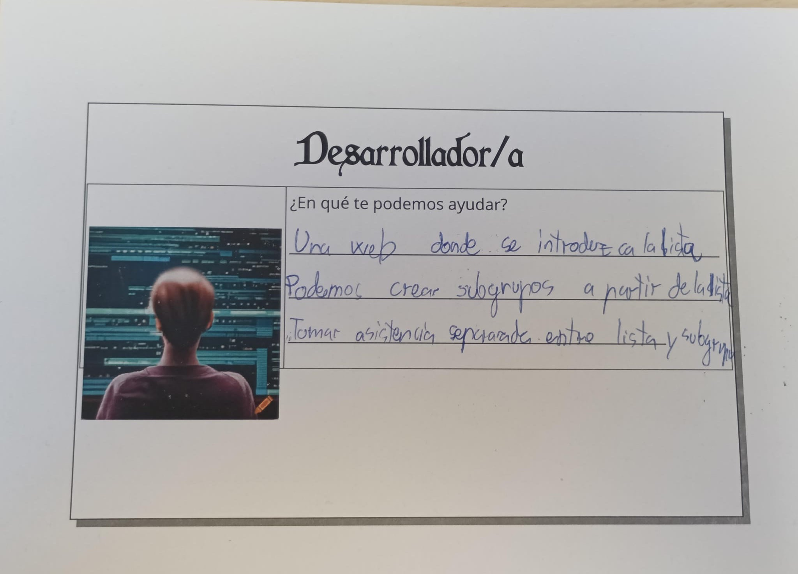

# IV Asistencia

## Descripción del problema

Como estudiantes, los horarios de las clases condicionan las actividades que podemos hacer a lo largo del día. Cuando terminamos una clase y tenemos otra más tarde, a veces queremos ir al gimnasio, comer o realizar otra actividad antes de ir a la siguiente clase (que puede ser en otro campus).
Muchos estudiantes no disponemos de vehículo propio y utilizamos el autobús para desplazarnos. Sus horarios y las esperas hacen que no siempre sepamos si podremos realizar esa actividad durante el tiempo que necesitamos y llegar puntualmente a la siguiente clase, o si debemos dejarla para otro momento.

## Especifiación adicional del problema

Se consideran tres paradas conocidas: la de origen, la del lugar de la actividad intermedia y la de destino. Los dos desplazamientos se realizan en autobús mediante líneas directas, sin transbordos.
Para una fecha concreta, se establecen una hora a partir de la cual se puede salir del origen, una hora límite de llegada al destino y un tiempo mínimo de estancia intermedia. Ese tiempo se mide entre la llegada del primer autobús y la salida del segundo en la parada intermedia.
Quedan fuera del alcance los retrasos, la información en tiempo real y los desplazamientos a pie entre las paradas y los lugares de las actividades.

## Descripción del dataset

La fuente de datos es el [GTFS estático de los autobuses urbanos de Granada](http://movilidadgranada.org/gtfs/gtfs.zip). Es un archivo ZIP que contiene tablas en formato CSV con las paradas, líneas, viajes y horarios programados para el periodo en curso. 

Los archivos relevantes son:
- `stops.txt`: las paradas.
- `routes.txt`: las líneas
- `trips.txt`: cada viaje de una línea, su dirección y el servicio al que pertenece
- `stop_times.txt`: cuándo pasa cada viaje por cada parada
- `calendar.txt`: días de la semana en los que opera cada servicio.
- `calendar_dates.txt`: añade o elimina servicios en fechas concretas.

## Lógica de negocio prevista

Una combinación es válida si cumple estas condiciones:

- El primer viaje sale de la parada de origen a partir de la hora indicada.
- Entre la llegada a la parada intermedia y la salida del segundo viaje transcurre, al menos, el tiempo mínimo establecido.
- El segundo viaje llega a la parada de destino antes de la hora límite o justo a esa hora.

Ambos viajes deben operar en la fecha indicada y recorrer las paradas en el orden correcto.

Si ninguna combinación cumple todas las condiciones, la actividad no se puede realizar.

## Material de la actividad

## Documentación de configuración

[Configuración del repositorio](docs/configuracion.md)
